# asciinema-to-svg

`asciinema-to-svg` is a Rust CLI that converts asciinema v2 and v3 cast files into themed animated SVG terminal recordings.

It is intentionally conversion-only: record with `asciinema`, then render with this tool.

## Quick Start

Build the project:

```bash
cargo build --release
```

Convert a cast with the default macOS theme:

```bash
cargo run -- demo.cast --output demo.svg
```

Use another built-in theme:

```bash
cargo run -- demo.cast --theme linux --output demo-linux.svg
cargo run -- demo.cast --theme powershell --output demo-windows.svg
```

Override the output size and title:

```bash
cargo run -- demo.cast --width 1600 --height 900 --title "Build Output" --output demo.svg
```

Disable prompt remapping:

```bash
cargo run -- demo.cast --no-statusline --output plain.svg
```

Load a custom theme file:

```bash
cargo run -- demo.cast --theme ./themes/my-theme.json --output custom.svg
```

## Examples

### macOS (default theme)



### Linux



### Windows (PowerShell)



## Features

- Imports asciinema v2 and v3 casts
- Emits animated SVG output by default
- Ships with `macos`, `linux`, and `powershell` themes
- Enables statusline prompt remapping by default
- Supports custom theme JSON files
- Allows explicit output `--width`, `--height`, and `--title` overrides

## Current Scope

- No recording functionality
- No PTY or shell spawning
- No alternate output formats
- No subcommands

## Documentation

- [Docs Index](/Users/russ.mckendrick/Code/asciinema-to-svg/docs/README.md)
- [CLI Reference](/Users/russ.mckendrick/Code/asciinema-to-svg/docs/cli-reference.md)
- [Theme Format](/Users/russ.mckendrick/Code/asciinema-to-svg/docs/theme-format.md)
- [Rendering Pipeline](/Users/russ.mckendrick/Code/asciinema-to-svg/docs/rendering.md)

## Icons

Statusline segments can include icons from the bundled [Remix Icon](https://remixicon.com/) set (3,229 icons). Icons are embedded in the binary at build time — no external files needed at runtime.

> Icons by [Remix Icon](https://remixicon.com/) — licensed under the [Remix Icon License v1.0](https://github.com/Remix-Design/RemixIcon/blob/master/License).

## Development

```bash
cargo test
cargo fmt
```
